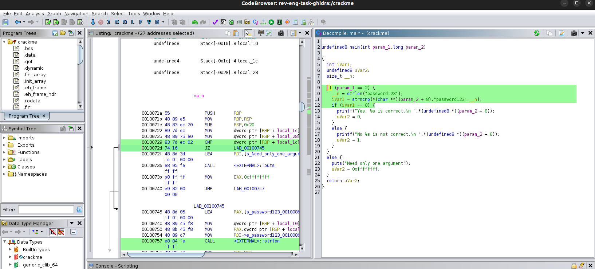

# Rev-eng-task 

Forsøker meg på litt enkel reverse-engineering av et c-program.  
Oppgaven går ut på å finne det hardkodede passordet i executablen i det kompilerte C-programmet.

## Verktøy  

gdb (Gnu debugger)  
[peda](https://github.com/longld/peda) (python exploitation development assistance)  
strings  

### Hvordan bruke gnu debugger  

```sh
gdb crackme 	# laster executable inn i gdb
```

```GDB
(gdb) set disassembly-function intel	# Setter syntaksen på assmbly til intel spesifikk syntax
(gdb) disas main	# Viser assemblykoden for main-funksjonen  
(gdb) break *main	# Setter breakpoint på main-funksjonen  
(gdb) run noe		# Kjører executablen med argumentet "noe" og stopper på første breakpoint som er der main-funksjonen starter
(gdb) ni	# stepper gjennom programmet linje for linje

```

Etter å ha kjørt __disas main__ la jeg merke til puts-kommandoen.
Valgte å bruke kommandoen: x/s <minneaddresse>
x/s  - som betyr å printe, men i string-format  

```GDB
(gdb) x/s 0x0000555555400736
0x555555400736 <main+28>:	"\350\225\376\377\377\270\377\377\377\377", <incomplete sequence \351\202>
```

Feilmeldingen: "<incomplete sequence" stammer fra at noen karakterer som skal printes ut ikke kan printes pga formatet i terminalen. Det ga ingen mening for meg, da GDB var konfigurert til å bruke UTF-8 og terminalen brukte også UTF-8.  
Denne måten å finne passordet på ble derfor et blindspor.  


### strings

Hvordan installere strings:  
```shell
sudo apt install binutils
```

Henter ut alle ascii-verdier i en executable.
Det er mulig å finne passordet i crackme'en i programmet med denne.  

```shell
➜  rev-eng-task git:(main) strings crackme  ### kjører strings-kommandoen  
/lib64/ld-linux-x86-64.so.2
libc.so.6
strncmp
puts
printf
strlen
__cxa_finalize
__libc_start_main
GLIBC_2.2.5
_ITM_deregisterTMCloneTable
__gmon_start__
_ITM_registerTMCloneTable
=9	 
AWAVI
AUATL
[]A\A]A^A_
Need only one argument
password123                               <-------- denne teksten er interessant å teste som input til programmet  
No %s is not correct.
Yes, %s is correct.

```

Output
```shell
gdb-peda$ r password123
Starting program: /home/bragalund/kode/rev-eng-task/crackme password123
[Thread debugging using libthread_db enabled]
Using host libthread_db library "/lib/x86_64-linux-gnu/libthread_db.so.1".
Yes, password123 is correct.        <----
```

Det hardkodede passordet i executablen er: password123

## Hvordan bruke Ghidra  

Ghidra kan brukes for reverse-engineering.

```shell
sudo snap install ghidra
```



Man kan enkelt se hvilke tekst som sammenlignes, og det er enkelt å se hva passordet må være, for å være riktig, i strncmp-funksjonen.  


## Annen kunnskap  

## Assembly  

Man finner assembly-koden til programmet ved å kjøre kommandoen:
```shell
disas main
```

```dump
gdb-peda$ disas main
Dump of assembler code for function main:
   0x000055555540071a <+0>:	push   rbp
   0x000055555540071b <+1>:	mov    rbp,rsp
   0x000055555540071e <+4>:	sub    rsp,0x20
   0x0000555555400722 <+8>:	mov    DWORD PTR [rbp-0x14],edi
   0x0000555555400725 <+11>:	mov    QWORD PTR [rbp-0x20],rsi
   0x0000555555400729 <+15>:	cmp    DWORD PTR [rbp-0x14],0x2
   0x000055555540072d <+19>:	je     0x555555400745 <main+43>
   0x000055555540072f <+21>:	lea    rdi,[rip+0x11e]        # 0x555555400854
   0x0000555555400736 <+28>:	call   0x5555554005d0 <puts@plt>
   0x000055555540073b <+33>:	mov    eax,0xffffffff
   0x0000555555400740 <+38>:	jmp    0x5555554007c7 <main+173>
   0x0000555555400745 <+43>:	lea    rax,[rip+0x11f]        # 0x55555540086b
   0x000055555540074c <+50>:	mov    QWORD PTR [rbp-0x8],rax
   0x0000555555400750 <+54>:	mov    rax,QWORD PTR [rbp-0x8]
   0x0000555555400754 <+58>:	mov    rdi,rax
   0x0000555555400757 <+61>:	call   0x5555554005e0 <strlen@plt>
   0x000055555540075c <+66>:	mov    rdx,rax
   0x000055555540075f <+69>:	mov    rax,QWORD PTR [rbp-0x20]
   0x0000555555400763 <+73>:	add    rax,0x8
   0x0000555555400767 <+77>:	mov    rax,QWORD PTR [rax]
   0x000055555540076a <+80>:	mov    rcx,QWORD PTR [rbp-0x8]
   0x000055555540076e <+84>:	mov    rsi,rcx
   0x0000555555400771 <+87>:	mov    rdi,rax
   0x0000555555400774 <+90>:	call   0x5555554005c0 <strncmp@plt>
   0x0000555555400779 <+95>:	test   eax,eax
   0x000055555540077b <+97>:	je     0x5555554007a3 <main+137>
   0x000055555540077d <+99>:	mov    rax,QWORD PTR [rbp-0x20]
   0x0000555555400781 <+103>:	add    rax,0x8
   0x0000555555400785 <+107>:	mov    rax,QWORD PTR [rax]
   0x0000555555400788 <+110>:	mov    rsi,rax
   0x000055555540078b <+113>:	lea    rdi,[rip+0xe5]        # 0x555555400877
   0x0000555555400792 <+120>:	mov    eax,0x0
   0x0000555555400797 <+125>:	call   0x5555554005f0 <printf@plt>
   0x000055555540079c <+130>:	mov    eax,0x1
   0x00005555554007a1 <+135>:	jmp    0x5555554007c7 <main+173>
   0x00005555554007a3 <+137>:	mov    rax,QWORD PTR [rbp-0x20]
   0x00005555554007a7 <+141>:	add    rax,0x8
   0x00005555554007ab <+145>:	mov    rax,QWORD PTR [rax]
   0x00005555554007ae <+148>:	mov    rsi,rax
   0x00005555554007b1 <+151>:	lea    rdi,[rip+0xd7]        # 0x55555540088f
   0x00005555554007b8 <+158>:	mov    eax,0x0
   0x00005555554007bd <+163>:	call   0x5555554005f0 <printf@plt>
   0x00005555554007c2 <+168>:	mov    eax,0x0
   0x00005555554007c7 <+173>:	leave  
   0x00005555554007c8 <+174>:	ret    

```

### Registre  

Variabler lagret i registret kjøres som regel i register-file.
Programmer som bare bruker registry, kører fortere enn de som bruker stacken, som kjører i cachene eller i RAM.
Register-file er raskest, deretter L1-cache, deretter L2-cache og til slutt RAM.  

Man har 8-32 globale variabler kalt "registers".   
De har en satt størrelse.  

RIP / IP / EIP = viktig registeri/variabel.
Også kalt program counter. 
Sier noe om hvilken instruksjon som er den neste til å bli kalt i programmet.

ESP - stack-pointer  
Peker til toppen av stacken.  

zeroflag - 

### Funksjoner  

_cmp_ = compare  -  sammenligner noe, f.eks et tall i en int
_je_ = jump equal, - går til en minneadresse når noe er likt
_jne_ = jump not equals - går til en minneaddresse, hvis noe ikke er likt

_mov_ = move - betyr at man setter en verdi til en minneadresse eller til en variabel i registeret.  
_add_ og _sub_ er + og - i cpu-verden.  
F.eks. mov eax, 0x5  betyr at verdien i eax nå er verdi 5  
add eax, 0x2 - gjør at eax = 5+2 = 7  
sub eax, 0x3 - eax er nå 7 - 3 = 4  

_call_ = eksternt funksjonskall.   
_push_ = setter en verdi i stacken og inkrementerer stack pointer-verdien.  
_pop_ = Henter verdi fra toppen av stack og deinkrementerer pointer-verdien til stacken. 
_jump_ = Hopper til en minneadresse.  

 Man kan ofte bruke man-pages i linux for å finne ut av hva funksjonen gjør. F.eks call 0x5d0 <puts@plt> bruker puts-metoden. Som betyr å skrive til konsollet som printf.

